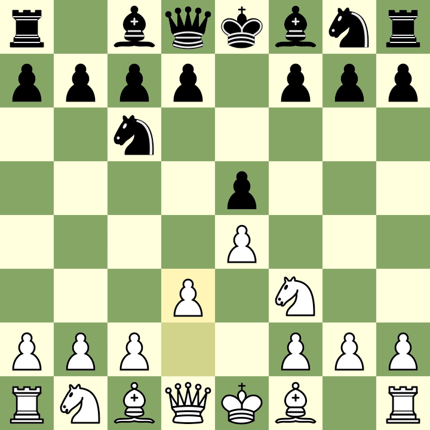

# Hey, I'm Ragib 👋

I'm a software engineer from Bangladesh. I write code in Go, C, and Python, mostly for backend systems. I run [DevEleven-io](https://github.com/DEVELEVEN-io) and like working on open-source projects and small automation tools.

Always up for building something useful — feel free to reach out.

## ♟️ Join my community Chess game!

Participation is open to everyone! To play a move, comment on [this issue](https://github.com/YOUR_USERNAME/YOUR_REPO/issues/1) like this: `/move e4`

It is team **black**'s turn to play.

Curious about how it all works? [Explore the details here](https://github.com/ragibalasad/ragibalasad/tree/main/) to see what’s going on under the hood.

**:alarm_clock: Most recent moves**
| Team | Move | Made by |
| ---- | ---- | ------- |
| white | e5 | [@test](https://github.com/) |
| black | Be4 | [@test](https://github.com/) |
| white | exg7 | [@test](https://github.com/) |

**:trophy: Community Leaderboard :1st_place_medal:**
| Player | 🧠 Moves | 🗡️ Captures | 👑 Checkmate |
| ---- | ---- | ------- | ----- |
| [@test](https://github.com/) | 67 | 54 | 23 |

_Only one move per user in a row. Keep the game going!_

